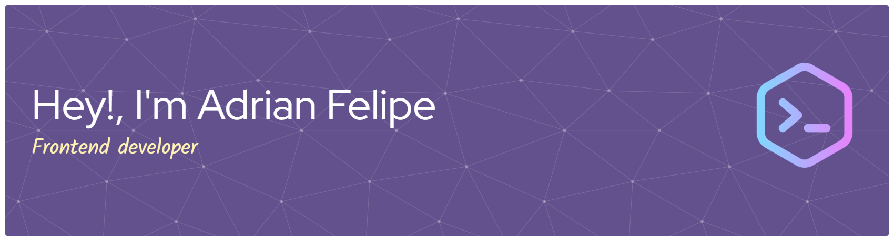

  
  <h1>
    Hi!, I'm Adrian Felipe 👋
  </h1>
  
  <h3>
    Desarrollador Frontend | Especialista en Angular
  </h3>
  

  

---

## 👨‍💻 Sobre Mí

Soy un desarrollador Frontend con [X] años de experiencia, especializado en la **creación de aplicaciones web robustas y escalables con Angular**. Mi pasión es construir interfaces de usuario (UI) intuitivas y de alto rendimiento, cuidando siempre la calidad del código y las buenas prácticas (Clean Code, SOLID).

* 🚀 Mi ecosistema principal es **Angular**, con sólida experiencia en TypeScript, RxJS, NgRx (o Akita/Elf) y Angular Material.
* 🌱 Actualmente estoy ampliando mi stack, explorando **React** para componentes dinámicos y **Astro** para sitios de contenido estático (SSG) de alta velocidad.
* 💡 Busco colaborar en proyectos desafiantes donde pueda aplicar mi experiencia y seguir creciendo como desarrollador.

 

---

## 🛠️ Mi Stack Tecnológico

  
<strong>Ecosistema Principal (Angular)</strong>

  
  
  
  
  

  
<strong>Aprendiendo Actualmente</strong>

  
  

  
<strong>Frontend General & Herramientas</strong>

  
  
  
  

 

---

## 🚀 Proyectos Destacados

<table border="0" cellpadding="10" cellspacing="0" width="100%">
  <tr valign="top">
    <td width="50%">
      
      <h3>Dashboard de 'Nombre' (Angular)</h3>
      
App web empresarial (SPA) construida con Angular 16+, NgRx para gestión de estado global y Angular Material. Enfocada en visualización de datos en tiempo real.

      
      
    </td>
    
    <td width="50%">
      
      <h3>Mi Blog Personal (Astro/React)</h3>
      
Proyecto personal para explorar SSG. Sitio de contenido estático ultrarrápido construido con Astro, utilizando componentes de React (UI) para la interactividad.

      
      
    </td>
  </tr>
  </table>

 

---

## 📊 Mis Estadísticas

  
   
  

 

---

## 📫 Contacto

  
¡Conectemos! Estoy disponible para nuevas oportunidades y colaboraciones.

  
  <a href="https://www.linkedin.com/in/[TU_LINKEDIN_USERNAME]" target="_blank">
    <img src="
